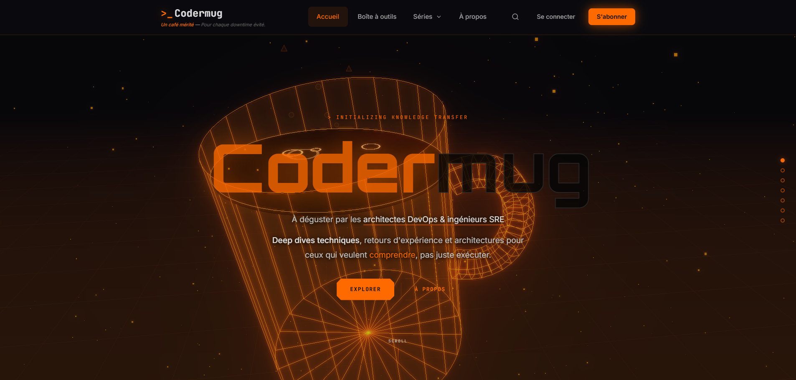

# Codermug Ghost Theme

[](https://ghost.org/)
[](https://www.w3.org/Style/CSS/)
[](https://developer.mozilla.org/en-US/docs/Web/JavaScript)
[](https://handlebarsjs.com/)

[](https://opensource.org/licenses/MIT)
[](https://github.com/Astocanthus/codermug-ghost-theme/releases)
[](https://github.com/Astocanthus/codermug-ghost-theme/issues)

A cyberpunk-inspired Ghost theme, featuring orange neon effects, animated circuit backgrounds, and a developer-focused design.

## Features

- **Cyberpunk Aesthetic** - Design with orange neon glows
- **Animated Circuit Background** - Canvas-based animated grid with particles
- **Interactive About Page** - Full-page scroll hijacking with terminal animations
- **Responsive Design** - Mobile-first approach with hamburger navigation
- **Tag-based Icons** - Dynamic emoji icons based on post tags
- **Reading Progress** - Visual indicator for article progress
- **Random Slogans** - Rotating taglines in the header
- **Dark Mode Native** - Built from the ground up for dark interfaces

## Preview



## Quick Start

### Installation

1. Download the latest release from [GitHub Releases](https://github.com/Astocanthus/codermug-ghost-theme/releases)
2. Upload the ZIP file in Ghost Admin → Settings → Design → Change theme
3. Activate the theme

### Manual Installation

```bash
cd /var/lib/ghost/content/themes/
git clone https://github.com/Astocanthus/codermug-ghost-theme.git
ghost restart
```

## Directory Structure

```
codermug-ghost-theme/
├── assets/
│   ├── css/
│   │   ├── style.css          # Main stylesheet (imports all)
│   │   ├── variables.css      # Design tokens & CSS variables
│   │   ├── base.css           # Reset & typography
│   │   ├── header.css         # Navigation & header
│   │   ├── cards.css          # Article cards & grid
│   │   ├── content.css        # Post content styles
│   │   ├── footer.css         # Footer styles
│   │   ├── koenig.css         # Ghost editor blocks
│   │   ├── responsive.css     # Media queries
│   │   ├── manual-nav.css     # Post navigation
│   │   └── about.css          # About page specific
│   ├── js/
│   │   ├── circuit.js         # Background animation
│   │   ├── navigation.js      # Mobile menu
│   │   ├── slogan.js          # Random slogans
│   │   ├── tag-icons.js       # Dynamic tag icons
│   │   └── about.js           # About page scroll
│   └── images/
│       └── hero-bg.png        # Hero background
├── partials/
│   └── ...                    # Reusable components
├── default.hbs                # Base template
├── index.hbs                  # Homepage
├── post.hbs                   # Single post
├── page.hbs                   # Static pages
├── page-about.hbs             # About page template
├── tag.hbs                    # Tag archive
├── author.hbs                 # Author archive
├── error.hbs                  # Error pages
└── package.json               # Theme configuration
```

## Configuration

### Design Tokens

All colors derive from a single hue variable for easy theming:

```css
:root {
  --hue-orange: 25;  /* Change this to shift entire color palette */
}
```

### Tag Icons

Edit `assets/js/tag-icons.js` to customize icons:

```javascript
const tagIcons = {
  'kubernetes': '☸️',
  'docker': '🐳',
  'devops': '♾️',
  'default': '💻'
};
```

### Slogans

Edit `assets/js/slogan.js` to add your own rotating taglines:

```javascript
const slogans = [
  { title: "Self-hosted", subtitle: "Powered by Docker and caffeine" },
  // Add more...
];
```

## Pages

### About Page

The theme includes a special About page template with:

- Full-page scroll hijacking
- Interactive terminal animation
- Tech stack showcase with animated cards
- Navigation dots

To use it:
1. Create a new page in Ghost
2. Set the slug to `about`
3. The template will be automatically applied

## Browser Support

- Chrome (latest)
- Firefox (latest)
- Safari (latest)
- Edge (latest)

## Dependencies

### Fonts (loaded from Google Fonts)

- **Inter** - Body text
- **JetBrains Mono** - Code & monospace
- **Orbitron** - Display headings

## Development

### Local Development

```bash
# Clone the repository
git clone https://github.com/Astocanthus/codermug-ghost-theme.git

# Navigate to theme directory
cd codermug-ghost-theme

# If using Ghost local development
ghost install local
ln -s /path/to/codermug-ghost-theme content/themes/codermug-ghost-theme
ghost restart
```

### File Watching

```bash
# Using Ghost's built-in file watching
ghost run --development
```

## Customization

### Changing the Primary Color

1. Open `assets/css/variables.css`
2. Modify `--hue-orange` value (0-360)
3. All derived colors will update automatically

### Adding New Tag Icons

1. Open `assets/js/tag-icons.js`
2. Add your tag slug and emoji to the `tagIcons` object

## Changelog

See [CHANGELOG.md](CHANGELOG.md) for release history.

## License

This project is open source and available under the [MIT License](LICENSE).

## Contributing

1. Fork the repository
2. Create a feature branch (`git checkout -b feature/amazing-feature`)
3. Commit your changes (`git commit -m 'Add amazing feature'`)
4. Push to the branch (`git push origin feature/amazing-feature`)
5. Open a Pull Request

## Author

**Benjamin Romeo** - DevOps & Infrastructure Architect

- GitHub: [@Astocanthus](https://github.com/Astocanthus)
- LinkedIn: [Benjamin Romeo](https://www.linkedin.com/in/benjamin-romeo-1a533093/)

## Acknowledgments

- Inspired by Tron Legacy aesthetics
- Built for the [Ghost](https://ghost.org/) publishing platform
- Icons from various emoji sets